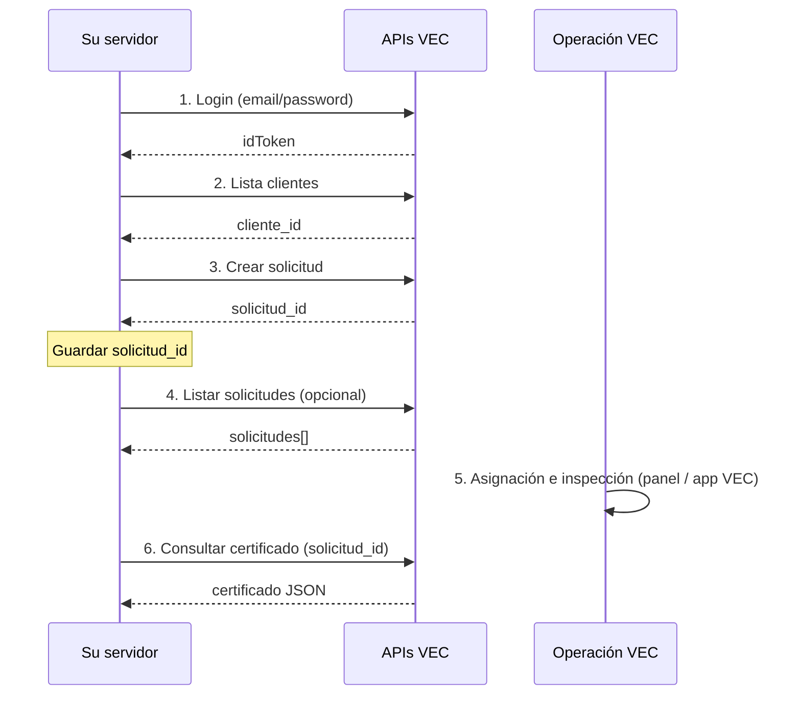

# Integración API — Prevalidadores ↔ VEC

Documentación para **equipos de sistemas de prevalidadores** que consumen las APIs HTTP de **VEC** (integración server-to-server). No incluye despliegue, configuración de servidores VEC ni acceso directo a la base de datos de VEC.

**Base URL (producción):** `https://us-central1-vec-v2.cloudfunctions.net`

---

## APIs disponibles

| Orden | API | Documento |
|---|---|---|
| 1 | `prevalidadorLogin` | [Autenticación y guía general](./prevalidador-auth.md) |
| 2 | `prevalidadorListaClientes` | [Lista de clientes](./prevalidador-lista-clientes.md) |
| 3 | `prevalidadorSolicitudInspeccion` | [Crear solicitud de inspección](./prevalidador-solicitud-inspeccion.md) |
| 4 | `prevalidadorListaSolicitudes` | [Lista de solicitudes](./prevalidador-lista-solicitudes.md) |
| 5 | `prevalidadorConsultaCertificado` | [Consultar certificado](./prevalidador-consulta-certificado.md) |

---

## Flujo completo recomendado

1. Obtener `idToken` con credenciales que **VEC** entregó a su organización.
2. Listar clientes con contrato vigente y elegir `cliente_id`.
3. Crear la solicitud de inspección; **guardar `solicitud.id`** en su sistema.
4. Consultar el listado de solicitudes (opcional), por ejemplo para conciliar registros.
5. Esperar a que VEC asigne crédito y se ejecute la inspección (fuera de estas APIs).
6. Consultar el certificado con el mismo `solicitud_id`.

Detalle de autenticación, renovación de token y alcance de datos: [prevalidador-auth.md](./prevalidador-auth.md).

---

## Soporte

Ante credenciales, altas de prevalidador o incidencias operativas (asignación, inspección), contactar al equipo **VEC** que administra su cuenta.
