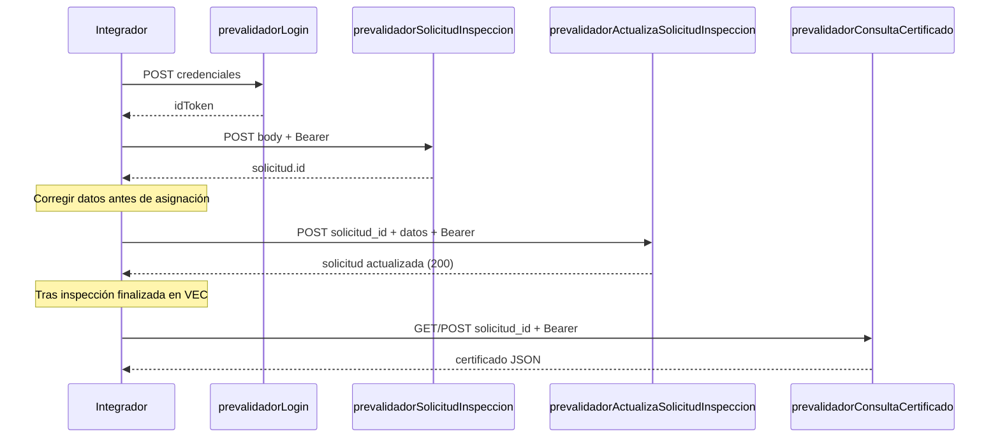

# API `prevalidadorActualizaSolicitudInspeccion`

Actualiza una **solicitud de inspección existente** del prevalidador autenticado.

- El **prevalidador** se identifica con el token de sesión (no se envía en el body).
- Debe indicar el **`solicitud_id`** de la solicitud a modificar (el mismo `id` devuelto al crearla).
- Los demás campos del body son los mismos que en [`prevalidadorSolicitudInspeccion`](./prevalidador-solicitud-inspeccion.md).
- Solo se pueden actualizar solicitudes en estatus **`pendiente`** o **`enProceso`**.
- Si la inspección vinculada ya está **finalizada**, la operación se rechaza y **no se modifica ningún dato**.
- VEC actualiza `modifiedAt` y `modifiedBy` con el prevalidador de la sesión.
- Si la solicitud ya tiene asignación o inspección en curso, VEC propaga los datos del vehículo y del cliente a los registros vinculados.

**Requisitos previos:** [`prevalidadorLogin`](./prevalidador-auth.md), [`prevalidadorSolicitudInspeccion`](./prevalidador-solicitud-inspeccion.md) (o un `solicitud_id` obtenido de [`prevalidadorListaSolicitudes`](./prevalidador-lista-solicitudes.md)).

---

## Endpoint

| | |
|---|---|
| **Método** | `POST` |
| **URL (prod)** | `https://us-central1-vec-v2.cloudfunctions.net/prevalidadorActualizaSolicitudInspeccion` |
| **Content-Type** | `application/json` |
| **Auth** | `Authorization: Bearer <idToken>` |

---

## Request body

| Campo | Tipo | Requerido | Validación |
|---|---|---|---|
| `solicitud_id` | string | Sí | Debe existir y pertenecer al prevalidador del token |
| `cliente_id` | string | Sí | Debe existir y ser elegible para el prevalidador del token |
| `vin` | string | Sí | No vacío |
| `fabricante` | string | Sí | No vacío |
| `modelo` | string | Sí | No vacío |
| `pais` | string | Sí | No vacío |
| `anio_modelo` | number o string | Sí | Entero entre `1900` y año actual + 1 |
| `nombre_propietario` | string | Sí | No vacío |

También se aceptan alias en camelCase (`solicitudId`, `clienteId`, `anioModelo`, `nombrePropietario`) por compatibilidad.

### Ejemplo

```json
{
  "solicitud_id": "docIdExistente",
  "cliente_id": "abc123cliente",
  "vin": "1HGBH41JXMN109186",
  "fabricante": "Honda",
  "modelo": "Civic",
  "pais": "México",
  "anio_modelo": 2022,
  "nombre_propietario": "Juan Pérez"
}
```

```bash
curl -s -X POST \
  "https://us-central1-vec-v2.cloudfunctions.net/prevalidadorActualizaSolicitudInspeccion" \
  -H "Content-Type: application/json" \
  -H "Authorization: Bearer ${ID_TOKEN}" \
  -d '{
    "solicitud_id": "docIdExistente",
    "cliente_id": "abc123cliente",
    "vin": "1HGBH41JXMN109186",
    "fabricante": "Honda",
    "modelo": "Civic",
    "pais": "México",
    "anio_modelo": 2022,
    "nombre_propietario": "Juan Pérez"
  }'
```

---

## Response exitosa (200)

```json
{
  "success": true,
  "solicitud": {
    "id": "docIdExistente",
    "vin": "1HGBH41JXMN109186",
    "fabricante": "Honda",
    "modelo": "Civic",
    "pais": "México",
    "anioModelo": "2022",
    "nombrePropietario": "Juan Pérez",
    "estatus": "enProceso",
    "cliente": {
      "id": "abc123cliente",
      "nombre": "Razón Social SA de CV",
      "alias": "Taller Norte",
      "numeroPatente": "1234",
      "rfc": "XAXX010101000"
    },
    "prevalidador": {
      "id": "mBbzLMgHM8hruaQv7rjSA8bz2",
      "nombre": "CAAAREM"
    },
    "createdBy": {
      "tipo": "prevalidador",
      "id": "mBbzLMgHM8hruaQv7rjSA8bz2",
      "nombre": "CAAAREM",
      "email": "prevalidador@ejemplo.com"
    },
    "modifiedAt": "2026-06-09T18:30:00.000Z",
    "modifiedBy": {
      "tipo": "prevalidador",
      "id": "mBbzLMgHM8hruaQv7rjSA8bz2",
      "nombre": "CAAAREM",
      "email": "prevalidador@ejemplo.com"
    }
  }
}
```

### Metadatos de la solicitud actualizada

| Campo | Valor |
|---|---|
| `modifiedAt` | Marca de tiempo de la última modificación vía API |
| `modifiedBy` | Prevalidador de la sesión (`tipo: "prevalidador"`) |
| `estatus` | No cambia con esta API (`pendiente` o `enProceso` según el estado actual) |
| `createdBy` / `createdAt` | Sin cambios (datos de la creación original) |

**Obtener el `solicitud_id`:** respuesta de creación o [`prevalidadorListaSolicitudes`](./prevalidador-lista-solicitudes.md).

**Cuando la inspección ya terminó:** use [`prevalidadorConsultaCertificado`](./prevalidador-consulta-certificado.md); no es posible editar la solicitud.

---

## Errores

| HTTP | `error` | Cuándo |
|---|---|---|
| 400 | `VALIDATION_ERROR` | Campos faltantes, `anio_modelo` fuera de rango o solicitud no en `pendiente` / `enProceso` |
| 401 | `missing-token` / `invalid-token` | Token ausente o inválido |
| 403 | `not-prevalidador` / `prevalidador-inactivo` | Token no es prevalidador activo |
| 403 | `forbidden` | La solicitud no pertenece a este prevalidador |
| 403 | `cliente-no-elegible` | `cliente_id` sin contrato vigente con este prevalidador |
| 404 | `not-found` | `solicitud_id` no existe |
| 404 | `cliente-not-found` | `cliente_id` no existe |
| 409 | `inspeccion-finalizada` | La inspección vinculada ya está finalizada; no se actualiza nada |
| 405 | `METHOD_NOT_ALLOWED` | No es POST |
| 500 | `INTERNAL_ERROR` | Fallo interno |

### Ejemplo validación (400)

```json
{
  "success": false,
  "error": "VALIDATION_ERROR",
  "message": "Datos de entrada inválidos",
  "details": [
    { "field": "solicitud_id", "message": "Solo se pueden actualizar solicitudes en estatus pendiente o enProceso" }
  ]
}
```

### Ejemplo inspección finalizada (409)

```json
{
  "success": false,
  "error": "inspeccion-finalizada",
  "message": "No se puede actualizar la solicitud porque la inspección ya está finalizada."
}
```

---

## Flujo integrador



Ver flujo completo: [README.md](./README.md).
