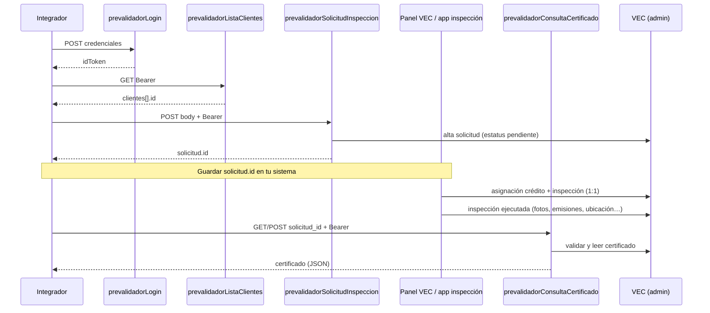

# API `prevalidadorConsultaCertificado`

Devuelve el **certificado de inspección** en JSON, con las mismas secciones que el reporte público de VEC: `https://smog.emissions.mx/reporte/{inspeccion_id}`.

La inspección se localiza por **`solicitud_id`** (el ID devuelto al crear la solicitud). En VEC existe una relación **1:1** entre esa solicitud y la inspección ejecutada.

**Requisitos previos:** [`prevalidadorLogin`](./prevalidador-auth.md), [`prevalidadorListaClientes`](./prevalidador-lista-clientes.md) y [`prevalidadorSolicitudInspeccion`](./prevalidador-solicitud-inspeccion.md). El certificado exige inspección vinculada con **`status: "finalizada"`** (pasos operativos en VEC / app de inspección).

---

## Flujo integrador (paso final)

Esta API cierra el ciclo server-to-server del prevalidador: recibes el JSON del certificado a partir del **`solicitud_id`** que obtuviste al crear la solicitud.



### Orden de pasos

| Paso | Quién | Qué ocurre | Salida útil |
|---|---|---|---|
| 1 | Integrador | `prevalidadorLogin` | `idToken` |
| 2 | Integrador | `prevalidadorListaClientes` | `cliente_id` para la solicitud |
| 3 | Integrador | `prevalidadorSolicitudInspeccion` | **`solicitud_id`** (guardar en tu BD) |
| 4 | Operación VEC | En panel web o app móvil VEC: asignar crédito y realizar la inspección | Inspección vinculada a su `solicitud_id` |
| 5 | Integrador | **`prevalidadorConsultaCertificado`** con ese `solicitud_id` | `certificado` + `inspeccion_id` |

### Cuándo llamar al certificado

- **Sí (200):** la inspección existe, está vinculada a la solicitud y su campo **`status`** en VEC es **`finalizada`**.
- **No (404 `certificado-no-disponible`):** la solicitud sigue en `pendiente` sin asignación, o la inspección aún no existe en VEC.
- **No (409 `inspeccion-no-completada`):** la inspección existe pero `status` no es `finalizada`. Mensaje: *«La inspección no se ha completado.»*
- Con inspección `finalizada`, si `resultadoVerificacion` es `null`, las emisiones BlueDriver aún no están en `finalizado`; el resto del certificado puede incluir fotos y datos generales.

### Relación solicitud ↔ inspección

```
solicitud_id (la guardó al crear la solicitud)
        │
        │  asignación e inspección en VEC (panel / app)
        ▼
inspeccion_id (lo devuelve esta API en la respuesta)
```

No envíe `inspeccion_id` en el request; VEC lo resuelve a partir de `solicitud_id` y valida que la solicitud sea de su prevalidador.

---

## Endpoint

| | |
|---|---|
| **Métodos** | `GET`, `POST` |
| **URL (prod)** | `https://us-central1-vec-v2.cloudfunctions.net/prevalidadorConsultaCertificado` |
| **Auth** | `Authorization: Bearer <idToken>` |

---

## Parámetros

| Parámetro | Ubicación | Requerido | Descripción |
|---|---|---|---|
| `solicitud_id` | query (GET) o body JSON (POST) | Sí | ID de la solicitud de inspección en VEC (respuesta del paso 3) |
| `timezone` | query o body JSON | No | Zona horaria **IANA** del cliente (p. ej. `America/Tijuana`). Por defecto: `America/Mexico_City`. Afecta `encabezado.fecha` (ISO 8601 con offset en esa zona). |

Alias aceptados: `solicitudId`.

### Ejemplo GET

```bash
curl -s -G \
  "https://us-central1-vec-v2.cloudfunctions.net/prevalidadorConsultaCertificado" \
  --data-urlencode "solicitud_id=SOLICITUD_ID" \
  --data-urlencode "timezone=America/Mazatlan" \
  -H "Authorization: Bearer ${ID_TOKEN}"
```

### Ejemplo POST

```bash
curl -s -X POST \
  "https://us-central1-vec-v2.cloudfunctions.net/prevalidadorConsultaCertificado" \
  -H "Content-Type: application/json" \
  -H "Authorization: Bearer ${ID_TOKEN}" \
  -d '{"solicitud_id":"SOLICITUD_ID","timezone":"America/Mazatlan"}'
```

---

## Respuesta exitosa (`200`)

```json
{
  "success": true,
  "solicitud_id": "...",
  "inspeccion_id": "...",
  "zona_horaria": "America/Mazatlan",
  "certificado": {
    "encabezado": { },
    "datosGeneralesYVehiculares": { },
    "resultadoVerificacion": null,
    "fotografias": { },
    "ubicacion": { }
  }
}
```

### Secciones (`certificado`)

| Sección | Contenido (equivalente al HTML) |
|---|---|
| `encabezado` | Folio, VEC LLC, patente, aduana, `fecha` (ISO 8601, p. ej. `2026-05-29T14:19:00-06:00`), equipo BlueDriver, MAC, URLs y texto QR de datos |
| `datosGeneralesYVehiculares` | Propietario, país, marca, VIN, año, modelo, odómetro CarInfo |
| `resultadoVerificacion` | `null` si emisiones no están `finalizado`; si no, `monitores[]` + `resultadoFinal` |
| `fotografias` | `fotos` y `fotosVin`: arrays de `{ posicion, url_imagen }`; resumen IA, odómetro en tablero |
| `ubicacion` | Lat/long formateadas (4 decimales) y `mapaEstaticoUrl` (Google Static Maps, mismas dimensiones que el reporte) |

<!-- `leyenda` (SEMARNAT / EPA / sitio) deshabilitada temporalmente en la API. -->

No se incluyen imágenes QR en base64 (solo `urlReportePublico` y `textoQrDatosInspeccion` para generarlas externamente).

La respuesta incluye `zona_horaria` con la zona IANA usada para interpretar `encabezado.fecha`.

---

## Errores

| HTTP | `error` | Cuándo |
|---|---|---|
| 400 | `VALIDATION_ERROR` | Falta `solicitud_id` |
| 401 | `missing-token`, `invalid-token`, … | Token ausente o inválido |
| 403 | `forbidden` | La solicitud no es del prevalidador |
| 404 | `not-found`, `certificado-no-disponible` | Solicitud inexistente o sin inspección |
| 409 | `inspeccion-no-completada` | Inspección con `status` distinto de `finalizada` |
| 409 | `inspeccion-ambigua` | Más de una inspección para la misma solicitud |
| 405 | `METHOD_NOT_ALLOWED` | No es GET ni POST |
| 500 | `INTERNAL_ERROR` | Error no controlado |
