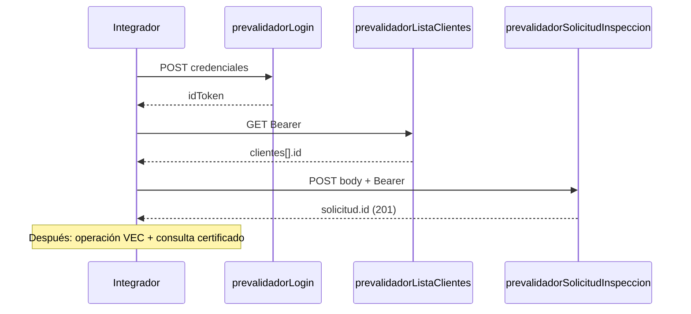

# API `prevalidadorSolicitudInspeccion`

Registra una **nueva solicitud de inspección** en VEC.

- El **prevalidador** se identifica con el token de sesión (no se envía en el body).
- El **estatus** inicial es siempre `pendiente` (no editable en creación).
- El **cliente** se indica con `cliente_id` y debe tener contrato vigente con ese prevalidador (mismo criterio que [`prevalidadorListaClientes`](./prevalidador-lista-clientes.md)).

**Requisitos previos:** [`prevalidadorLogin`](./prevalidador-auth.md) y, recomendado, [`prevalidadorListaClientes`](./prevalidador-lista-clientes.md) para obtener un `cliente_id` válido.

---

## Endpoint

| | |
|---|---|
| **Método** | `POST` |
| **URL (prod)** | `https://us-central1-vec-v2.cloudfunctions.net/prevalidadorSolicitudInspeccion` |
| **Content-Type** | `application/json` |
| **Auth** | `Authorization: Bearer <idToken>` |

---

## Request body

| Campo | Tipo | Requerido | Validación |
|---|---|---|---|
| `cliente_id` | string | Sí | Debe existir y ser elegible para el prevalidador del token |
| `vin` | string | Sí | No vacío |
| `fabricante` | string | Sí | No vacío |
| `modelo` | string | Sí | No vacío |
| `pais` | string | Sí | No vacío |
| `anio_modelo` | number o string | Sí | Entero entre `1900` y año actual + 1 |
| `nombre_propietario` | string | Sí | No vacío |

También se aceptan alias en camelCase (`clienteId`, `anioModelo`, `nombrePropietario`) por compatibilidad.

### Ejemplo

```json
{
  "cliente_id": "abc123cliente",
  "vin": "1HGBH41JXMN109186",
  "fabricante": "Honda",
  "modelo": "Civic",
  "pais": "México",
  "anio_modelo": 2022,
  "nombre_propietario": "Juan Pérez"
}
```

```bash
curl -s -X POST \
  "https://us-central1-vec-v2.cloudfunctions.net/prevalidadorSolicitudInspeccion" \
  -H "Content-Type: application/json" \
  -H "Authorization: Bearer ${ID_TOKEN}" \
  -d '{
    "cliente_id": "abc123cliente",
    "vin": "1HGBH41JXMN109186",
    "fabricante": "Honda",
    "modelo": "Civic",
    "pais": "México",
    "anio_modelo": 2022,
    "nombre_propietario": "Juan Pérez"
  }'
```

---

## Response exitosa (201)

```json
{
  "success": true,
  "solicitud": {
    "id": "nuevoDocId",
    "vin": "1HGBH41JXMN109186",
    "fabricante": "Honda",
    "modelo": "Civic",
    "pais": "México",
    "anioModelo": "2022",
    "nombrePropietario": "Juan Pérez",
    "estatus": "pendiente",
    "cliente": {
      "id": "abc123cliente",
      "nombre": "Razón Social SA de CV",
      "alias": "Taller Norte",
      "numeroPatente": "1234",
      "rfc": "XAXX010101000"
    },
    "prevalidador": {
      "id": "mBbzLMgHM8hruaQv7rjSA8bz2",
      "nombre": "CAAAREM"
    },
    "createdBy": {
      "tipo": "prevalidador",
      "id": "mBbzLMgHM8hruaQv7rjSA8bz2",
      "nombre": "CAAAREM",
      "email": "prevalidador@ejemplo.com"
    },
    "modifiedAt": null,
    "modifiedBy": null
  }
}
```

### Metadatos de la solicitud creada

| Campo | Valor |
|---|---|
| `createdBy` | Prevalidador de la sesión (`tipo: "prevalidador"`) |
| `modifiedAt` | `null` hasta que VEC modifique la solicitud |
| `modifiedBy` | `null` hasta que VEC modifique la solicitud |

La fecha de alta de la solicitud queda registrada en VEC como `fechaRegistro` (consultable en [`prevalidadorListaSolicitudes`](./prevalidador-lista-solicitudes.md)).

**Consultar solicitudes creadas:** [prevalidadorListaSolicitudes](./prevalidador-lista-solicitudes.md).

**Siguiente paso (cuando la inspección esté hecha en VEC):** [prevalidadorConsultaCertificado](./prevalidador-consulta-certificado.md) con el mismo `solicitud.id`.

---

## Errores

| HTTP | `error` | Cuándo |
|---|---|---|
| 400 | `VALIDATION_ERROR` | Campos faltantes o `anio_modelo` fuera de rango |
| 401 | `missing-token` / `invalid-token` | Token ausente o inválido |
| 403 | `not-prevalidador` / `prevalidador-inactivo` | Token no es prevalidador activo |
| 403 | `cliente-no-elegible` | `cliente_id` sin contrato vigente con este prevalidador |
| 404 | `cliente-not-found` | `cliente_id` no existe |
| 405 | `METHOD_NOT_ALLOWED` | No es POST |
| 500 | `INTERNAL_ERROR` | Fallo interno |

### Ejemplo validación (400)

```json
{
  "success": false,
  "error": "VALIDATION_ERROR",
  "message": "Datos de entrada inválidos",
  "details": [
    { "field": "vin", "message": "Requerido" },
    { "field": "anio_modelo", "message": "El año máximo es 2027" }
  ]
}
```

---

## Flujo integrador



Ver flujo completo: [README.md](./README.md) y [prevalidador-consulta-certificado.md](./prevalidador-consulta-certificado.md).
